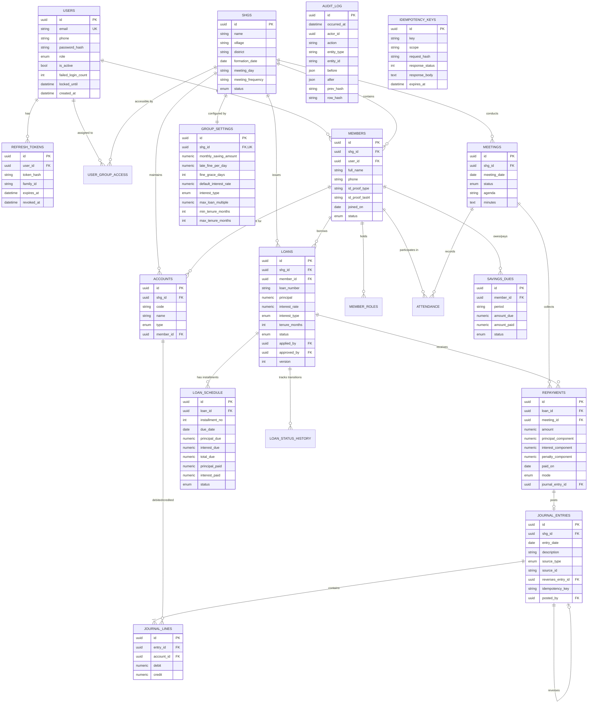

# Entity-Relationship Diagram

This Mermaid ER diagram captures the complete data architecture of the SHG Credit Management System across all functional domains.

```mermaid
erDiagram
    USERS ||--o{ REFRESH_TOKENS : "has"
    USERS ||--o{ USER_GROUP_ACCESS : "assigned to"
    USERS ||--o{ MEMBERS : "linked to"

    SHGS ||--|| GROUP_SETTINGS : "configured by"
    SHGS ||--o{ MEMBERS : "contains"
    SHGS ||--o{ MEETINGS : "conducts"
    SHGS ||--o{ LOANS : "issues"
    SHGS ||--o{ ACCOUNTS : "maintains"
    SHGS ||--o{ USER_GROUP_ACCESS : "accessible by"

    MEMBERS ||--o{ MEMBER_ROLES : "holds"
    MEMBERS ||--o{ ATTENDANCE : "participates in"
    MEMBERS ||--o{ SAVINGS_DUES : "owes/pays"
    MEMBERS ||--o{ LOANS : "borrows"
    MEMBERS ||--o{ ACCOUNTS : "sub-account for"

    MEETINGS ||--o{ ATTENDANCE : "records"
    MEETINGS ||--o{ REPAYMENTS : "collects"

    LOANS ||--o{ LOAN_SCHEDULE : "has installments"
    LOANS ||--o{ LOAN_STATUS_HISTORY : "tracks transitions"
    LOANS ||--o{ REPAYMENTS : "receives"

    JOURNAL_ENTRIES ||--|{ JOURNAL_LINES : "contains"
    JOURNAL_ENTRIES ||--o| JOURNAL_ENTRIES : "reverses"
    ACCOUNTS ||--o{ JOURNAL_LINES : "debited/credited"
    REPAYMENTS ||--o| JOURNAL_ENTRIES : "posts"

    USERS {
        uuid id PK
        string email UK
        string phone
        string password_hash
        enum role
        bool is_active
        int failed_login_count
        datetime locked_until
        datetime created_at
    }

    REFRESH_TOKENS {
        uuid id PK
        uuid user_id FK
        string token_hash
        string family_id
        datetime expires_at
        datetime revoked_at
    }

    SHGS {
        uuid id PK
        string name
        string village
        string district
        date formation_date
        string meeting_day
        string meeting_frequency
        enum status
    }

    GROUP_SETTINGS {
        uuid id PK
        uuid shg_id FK,UK
        numeric monthly_saving_amount
        numeric late_fine_per_day
        int fine_grace_days
        numeric default_interest_rate
        enum interest_type
        numeric max_loan_multiple
        int min_tenure_months
        int max_tenure_months
    }

    MEMBERS {
        uuid id PK
        uuid shg_id FK
        uuid user_id FK
        string full_name
        string phone
        string id_proof_type
        string id_proof_last4
        date joined_on
        enum status
    }

    MEETINGS {
        uuid id PK
        uuid shg_id FK
        date meeting_date
        enum status
        string agenda
        text minutes
    }

    SAVINGS_DUES {
        uuid id PK
        uuid member_id FK
        string period
        numeric amount_due
        numeric amount_paid
        enum status
    }

    LOANS {
        uuid id PK
        uuid shg_id FK
        uuid member_id FK
        string loan_number
        numeric principal
        numeric interest_rate
        enum interest_type
        int tenure_months
        enum status
        uuid applied_by FK
        uuid approved_by FK
        int version
    }

    LOAN_SCHEDULE {
        uuid id PK
        uuid loan_id FK
        int installment_no
        date due_date
        numeric principal_due
        numeric interest_due
        numeric total_due
        numeric principal_paid
        numeric interest_paid
        enum status
    }

    REPAYMENTS {
        uuid id PK
        uuid loan_id FK
        uuid meeting_id FK
        numeric amount
        numeric principal_component
        numeric interest_component
        numeric penalty_component
        date paid_on
        enum mode
        uuid journal_entry_id FK
    }

    ACCOUNTS {
        uuid id PK
        uuid shg_id FK
        string code
        string name
        enum type
        uuid member_id FK
    }

    JOURNAL_ENTRIES {
        uuid id PK
        uuid shg_id FK
        date entry_date
        string description
        enum source_type
        string source_id
        uuid reverses_entry_id FK
        string idempotency_key
        uuid posted_by FK
    }

    JOURNAL_LINES {
        uuid id PK
        uuid entry_id FK
        uuid account_id FK
        numeric debit
        numeric credit
    }

    AUDIT_LOG {
        uuid id PK
        datetime occurred_at
        uuid actor_id
        string action
        string entity_type
        string entity_id
        json before
        json after
        string prev_hash
        string row_hash
    }

    IDEMPOTENCY_KEYS {
        uuid id PK
        string key
        string scope
        string request_hash
        int response_status
        text response_body
        datetime expires_at
    }
```

